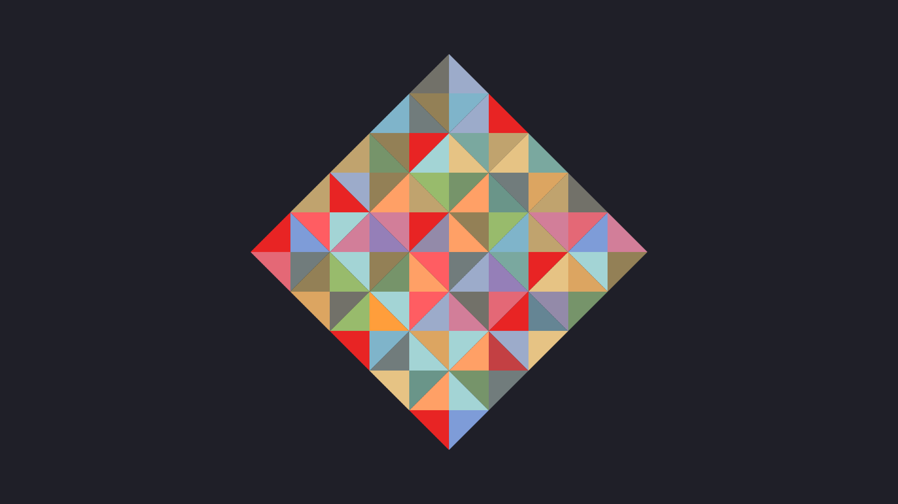
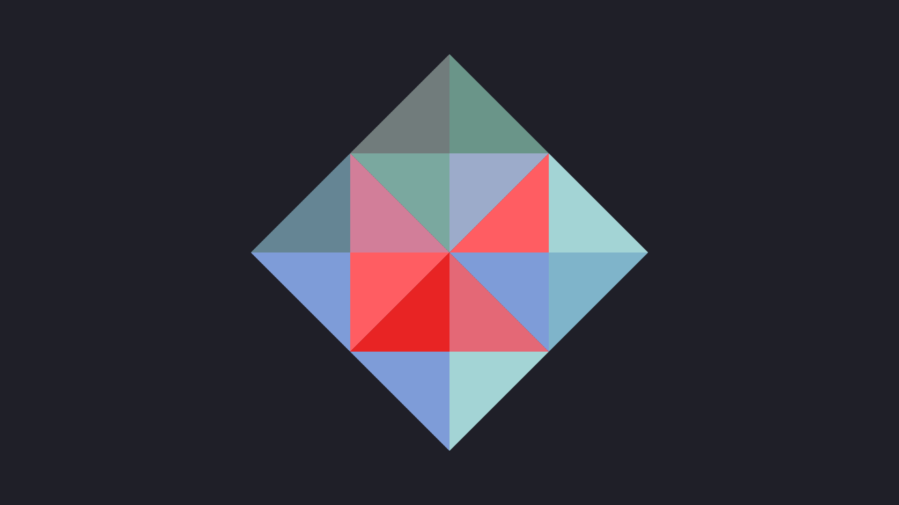

# Kanagawa colors frame generator

A silly web page that would let me have a wallpaper that matches my [color theme](https://github.com/rebelot/kanagawa.nvim).





## Usage

The dimension of the frame and the number of squares per side can be provided using URL parameters:

```
?frame_dimension={frameDimensionInPixels}&squares_per_side={numberOfSquaresPerSide}
```

## Author

- **Pierre-Alain Castella** - _Initial work_ - [metapho-re](https://github.com/metapho-re)

## License

This project is licensed under the MIT License - see the [LICENSE](LICENSE) file for details.
