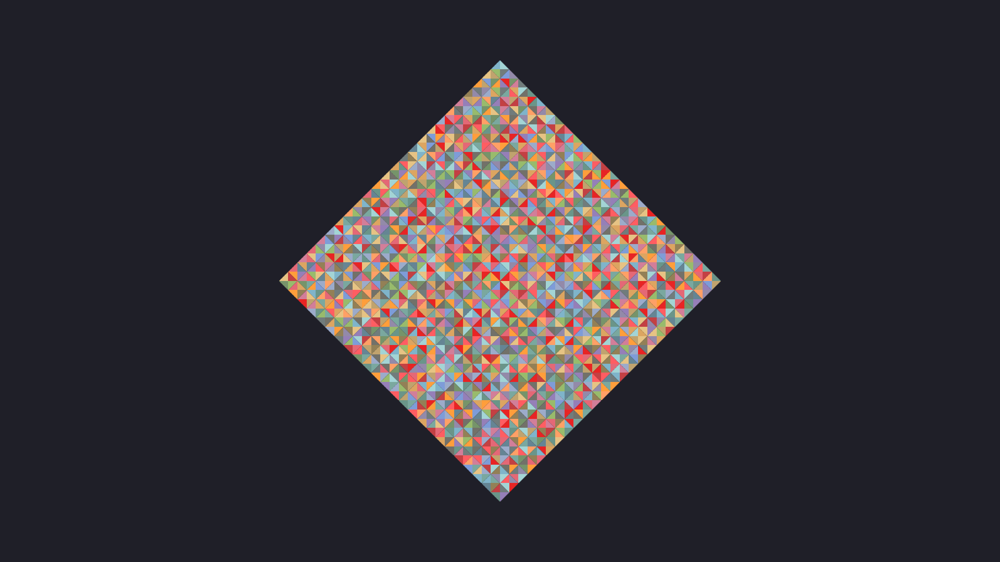

# Kanagawa colors frame generator

A silly web page that would let me have a wallpaper that matches my [color theme](https://github.com/rebelot/kanagawa.nvim).

## Author

* **Pierre-Alain Castella** - *Initial work* - [metapho-re](https://github.com/metapho-re)

## License

This project is licensed under the MIT License - see the [LICENSE](LICENSE) file for details.
